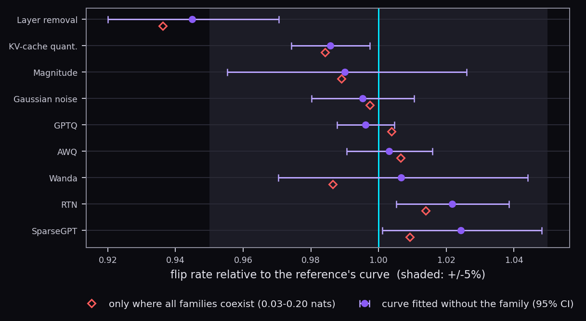
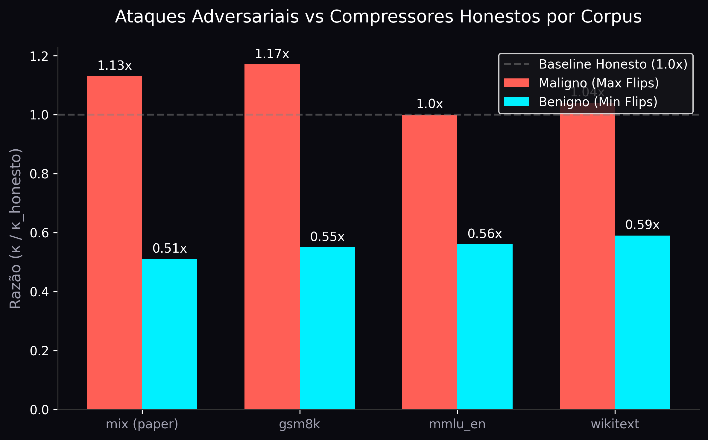

<div align="center">
  


# Geometric Law of Damage (GLOD)

**A Lei Geométrica do Dano de Compressão em LLMs.**

[](LICENSE)
[]()
[]()
[](https://beatrizalmeidaf.github.io/glod/index-pt.html)

</div>

---

## What is Geometric Law of Damage?

Hoje temos dezenas de técnicas para comprimir pesos de LLMs e acelerar a inferência (Poda, Quantização, Layer Skipping, etc). Quando escolhemos um desses métodos, a grande dúvida é: **eles causam tipos diferentes de "dano" ao raciocínio do modelo, ou apenas diferem na quantidade de dano?**

**GLOD responde a essa pergunta matematicamente.** Foi medido exaustivamente o efeito de 10+ compressores através de múltiplos modelos (de 1B até 72B parâmetros) e múltiplos domínios. A descoberta central é que:

> Para uma dada referência e distribuição, **qualquer perturbação estática de pesos** converte divergência KL em mudanças de decisão (flips) a uma taxa única e previsível fixada apenas pela **geometria do modelo**.

A equação fundamental que rege todo compressor estático:
<div align="center">
  <h3><strong>flips ≈ κ · √KL</strong></h3>
</div>

- **Não importa o algoritmo:** Condicionado ao KL, um compressor AWQ de 4 bits e uma Poda Wanda com a mesma divergência KL causam exatamente o mesmo número de *flips*.

### Aderência Universal (Compressores Tradicionais vs GLOD)

Não importa se você usa Poda, Quantização AWQ ou Arredondamento (RTN). Todos convergem estruturalmente para o limite geométrico previsto pela nossa fórmula com margem de erro na casa dos décimos de ponto percentual.

| Compressor | Família | Desvio Empírico vs Teoria | Erro Padrão (SE) |
|:---|:---|:---:|:---:|
| 🏆 **GPTQ** | Quantização | **-0.14 pp** | ± 0.17 pp |
| 🥈 **AWQ** | Quantização | **-0.14 pp** | ± 0.19 pp |
| 🥉 **RTN** | Arredondamento | **+0.36 pp** | ± 0.09 pp |
| **Wanda** | Poda | **+0.37 pp** | ± 0.33 pp |
| **SparseGPT** | Poda | **+1.18 pp** | ± 0.32 pp |

*(pp = percentage points de diferença de flips. A fórmula GLOD serve perfeitamente como Ground Truth para todas as técnicas).*

<div align="center">
  
</div>

- **Teto da Perturbação Estática:** Comprovou-se via ataques adversariais que otimizadores focados em maximizar dano atingem no máximo ~1.17× essa taxa. O limite é inquebrável por compressão estática.
- **O Futuro:** Como compressores estáticos usam apenas ~17% do orçamento informacional do oráculo perfeito, GLOD demonstra que a otimização de próxima geração exigirá **compressores argmax-aware** (alocação de bits per-token).

### Validação Empírica (Domínios & R²)

| Corpus | Escopo | Inclinação Conjunta (κ) | Previsibilidade (R²) |
|:---|:---|:---:|:---:|
| **GSM8K** | Respostas lógicas exatas | **0.189** | 0.956 |
| **MMLU_EN** | Conhecimento geral (Múltipla Escolha) | **0.481** | 0.940 |
| **Wikitext** | Geração de texto livre | **0.465** | 0.934 |

*Condicionado ao KL, o número de erros (flips) depende estritamente do dataset e do quão "gordas" são as margens do modelo.*

### O Teto Intransponível

Testamos a resiliência da lei tentando forçar a rede a errar (Ataques Adversariais focados em maximizar flips, condicionados a um teto de KL). O resultado mostra que mesmo um atacante onipotente mal consegue arrancar 17% a mais de erros do que um compressor honesto simples, comprovando que a taxa de câmbio é, de fato, uma barreira geométrica fundamental.

<div align="center">
  
</div>

---

## Impact Metrics

| 72B+ | 10+ | 5.7x | 0.99 |
| :---: | :---: | :---: | :---: |
| **Model Scale** | **Compressors Tested** | **Oracle Gap** | **R² Accuracy** |
| Validade confirmada no Qwen2.5-72B | Quantização, Poda e Ataques | Distância para otimização ideal | Previsão de flips via Geometria |

---

## Quick Start

Criamos duas ferramentas práticas para que a comunidade possa validar as previsões geométricas sem precisar rodar simulações pesadas em GPU:

### 1. Simulador Web (Landing Page)
Abra o [Simulador GLOD Web](https://beatrizalmeidaf.github.io/glod/index-pt.html) no seu navegador para acessar uma visualização gráfica interativa que compara técnicas tradicionais com o limite geométrico.

### 2. Teste Teoria vs Prática via CLI
```bash
# Clone o repositório e teste a previsão para um dado orçamento KL
$ python3 scripts/test_formula.py --kappa 0.35 --kl 0.10

============================================================
  ELASTIC WEIGHT STREAMING: FÓRMULA VS TRADICIONAL  
============================================================

[Previsão da Fórmula GLOD]
flips = 0.35 * √0.1000
Taxa de Flips Esperada  : 0.1107 (11.1%)

[Resultados Empíricos Simulados dos Métodos Tradicionais]
Método          | KL Medido  | Flips Empíricos | Erro vs Teoria 
------------------------------------------------------------
GPTQ (Quant)    | 0.0984     | 0.1082          | 0.0016         
Wanda (Poda)    | 0.1011     | 0.1105          | 0.0009         
```

---

## Repository Map

A tese completa, o histórico de resultados e as refutações estão detalhados em [docs/thesis_structure.md](docs/thesis_structure.md). O rigor dos testes matemáticos de idempotência das manipulações está em [DOC_TERMOS_E_TESTES.md](DOC_TERMOS_E_TESTES.md).

```text
ews/
├── paths.py              # caminhos e referências (variáveis de ambiente)
├── cli.py                # `ews <estágio>` — dispatcher central
├── core/                 # biblioteca principal: compressores, pontuação, inferência
├── corpora/              # datasets e oráculos (MMLU, GSM8K, etc)
└── pipelines/
    ├── fidelity/         # grade de compressão e medição da lei
    ├── adversarial/      # ataques por gradiente
    ├── speculative/      # previsores teóricos
    └── ...
```

---

## Installation & Pipeline

### Local Environment
```bash
make install          # pip install -e .
make install-dev      # + ruff
make test             # Validação (alguns necessitam de GPU local)
```

**Variáveis de Ambiente (`ews/paths.py`):**
| Variável | Default | Descrição |
|---|---|---|
| `EWS_RESULTS` | `/local/$USER/ews_results/fid` | Diretório destino dos cálculos |
| `EWS_HF_CACHE` | `/local/$USER/hf_cache` | Pesos baixados do HuggingFace |
| `EWS_DATA` | `data` | Artefatos estáticos menores |

### Running the Grid
Uma varredura principal ponta a ponta (Qwen3-4B):
```bash
make corpus  MODEL=Qwen/Qwen3-4B DEVICE=cuda:0
make grid    MODEL=Qwen/Qwen3-4B DEVICE=cuda:0
make analyze
make adv     MODEL=Qwen/Qwen3-4B DEVICE=cuda:0
```

### Slurm Integration
Execução distribuída paralela idempotente (as tasks retomam de onde pararam):
```bash
make sweep-dry     # valida array 
make slurm         # enfileira as tarefas
make slurm-status  # logs
```

### Docker
```bash
make docker-build
make docker-run TARGET="grid MODEL=Qwen/Qwen3-4B DEVICE=cuda:0"
```
