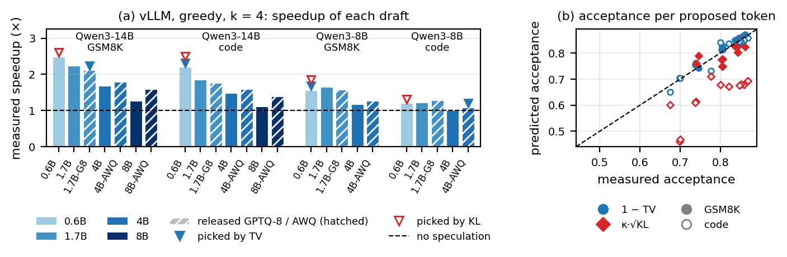

<div align="center">


# GLOD: How Divergence Becomes Decision Flips in Compressed LLMs

**Total variation distance, not KL divergence, tells you how many next-token decisions a quantized or pruned LLM changes, with no fitted constant.** Measured on 802 compressed copies of 19 open models (GPTQ, AWQ, SparseGPT, Wanda, KV-cache quantization, layer removal) and validated on speculative decoding in vLLM.

[](LICENSE)
[](https://github.com/beatrizalmeidaf/glod/actions/workflows/test.yml)
[](#citation)
[](https://github.com/beatrizalmeidaf/glod/tree/site-review)

Code and data for the paper *How Divergence Becomes Decision Flips in Compressed Language Models* (under review).

</div>

---

## Key results

- **Total variation reads as decisions.** Across nine perturbation families, the flip rate (how often the compressed model's arg-max token differs from the dense model's) tracks total variation distance at a median ratio of **1.05**, with no fitted constant; 95% of configurations fall within 0.89–1.29.
- **KL divergence reads as decisions only within one corpus.** Flips grow as √KL, but the conversion factor κ moves about **4×** across models and corpora. Of two compressors reported on different models and corpora whose flip rates differ by at least 10%, KL gives the smaller divergence to the one that changes more decisions in **11%** of cases, TV in **1%**.
- **Why: KL averages before it takes the root.** Most of κ's corpus dependence is a Jensen factor. Statistics that are first order at every token, such as Hellinger distance, are as stable as TV.
- **Speculative decoding.** TV measured under teacher forcing predicts greedy draft acceptance in vLLM with a mean error of **1.1–2.4%**, without the task-specific calibration that KL needs.
- **Held out.** Two pre-registered tests (a new code domain, and three new models with real kernels) confirm the ratio and mark where it fails.

GLOD is a research codebase: the full measurement pipeline behind the paper, the 802 measurements as a CSV, and `glod report`, which reports TV, flips and KL for any dense/compressed pair.

---

## What is the Geometric Law of Damage?

> [!NOTE]
> **Note on "Damage"**: In the context of GLOD, "Damage" refers strictly to **distributional deviation** from the dense oracle (teacher-forcing decision flips), not a loss in semantic capability or downstream task accuracy.

Today we have dozens of techniques to compress LLM weights and accelerate inference (pruning, quantization, layer skipping, etc.). When we choose one of these methods, the big question is: **do they cause different types of "damage" to the model's decisions, or do they merely differ in the amount of damage?** Prior work argues that accuracy hides compression damage and reports *flips* next to KL divergence ([Dutta et al., "Accuracy is Not All You Need", NeurIPS 2024](https://arxiv.org/abs/2407.09141)). GLOD asks how the divergences themselves convert into flips.

We measured nine perturbation families across **19 models** from six families (Gemma-3, Qwen3/2.5, Mistral, Phi, OLMo-2 and Llama-3), from 1B to 72B parameters, on five corpora — **802 configurations** in total — under teacher forcing, counting how often the compressed model's arg-max token differs from the dense model's (the *flip rate*, or one minus top-1 agreement). The central findings:

> **Total variation distance (TV)** — a first-order divergence — tracks the flip rate at a ratio near one (median 1.05; model-level mean 1.075, 95% CI [1.04, 1.11]) with **no fitted constant**. KL divergence tracks flips too, but only through a conversion factor κ = flips/√KL that varies 4.3× across models and corpora.

<div align="center">
  <h3><strong>flips ≈ TV,&nbsp;&nbsp;&nbsp; flips ≈ κ · √KL</strong></h3>
  
</div>

**Why KL needs a coefficient.** The square-root form is not an empirical finding: divergence is **second** order in the perturbation (for weights, the Fisher form below), while the decision margin moves at **first** order, so flips grow as √KL.

$$ \mathrm{KL} = \frac{1}{2} \delta^\top F \delta + O(\lVert\delta\rVert^3) $$

**Why κ varies (the Jensen factor).** κ decomposes exactly as κ = (flips/TV) · c · J, where J = E[√KL_t] / √E[KL_t]. Because KL is averaged over tokens *before* the square root, κ is small when the divergence is concentrated on a few tokens (GSM8K, where most tokens are near-certain; J ≈ 0.38) and larger when it is spread out (natural text; J ≈ 0.75). J carries **70%** of the variance of log κ across references; TV is first order at every token and has no such factor. A first-order model that uses only the dense model, flips/TV = √2·ρ(0)/E[h(p)] with h(p) = Σᵢ pᵢ√(1 − 2pᵢ + Σⱼpⱼ²) (isotropic logit displacement), predicts the per-reference ratio with a mean error of 10% and orders the references as measured (`python -m glod tv-theory`). As temperature goes to zero, flips/TV tends to exactly one, and its median stays between 1.01 and 1.11 for temperatures 0.25–2. The split is by order, not by statistic: Hellinger distance, also first order at every token, is nearly as stable across references (per-reference spread 1.54× vs 1.33× for TV), while √JS and √KL, both second order before the root, spread 3.6× and 4.0×.

**Where it holds.** The quadratic approximation is within 11% where κ is measured (KL < 0.05). Flips/√KL is flat up to ~0.25 nats, rises above it, and breaks at 2-bit weights, where KL reaches 8–18 nats and nearly every decision flips; flips/TV stays within about 25% of its window value throughout.

<div align="center">
  
</div>

---

## Quick Start

Two ways to check the predictions without running GPU experiments, and one command for your own checkpoints.

### 1. Web simulator
The interactive simulator lives on the [`site-review` branch](https://github.com/beatrizalmeidaf/glod/tree/site-review) (`index.html`, `index-pt.html`): pick a model, corpus and compressor, and compare the paper's two readings, κ·√KL and total variation, with the real measurements.

### 2. Test the law against real measurements, without a GPU

The file [`data/measurements.csv`](data/measurements.csv) contains the **802 measured configurations** from the paper — model, corpus, family, configuration, KL, flips and TV. The script below uses only the Python standard library and **simulates nothing**: it compares the prediction against what was actually observed.

```bash
# predicted vs measured, configuration by configuration, on one reference
$ python3 scripts/test_formula.py --model gemma-3-4b-it --corpus gsm8k

measured kappa (Eq. 4, window 0.001 < KL < 0.05) : 0.1299
fitted exponent in log-log                       : 0.5179  (R2 0.9960)

config       family               KL  measured flips predicted      error
----------------------------------------------------------------------
u8           rtn             0.00067       0.00361    0.00336   -6.8%
kv4          kv              0.01043       0.01327    0.01327   +0.0%
u5           rtn             0.01835       0.01740    0.01760   +1.1%
mag20        magnitude       0.04413       0.02839    0.02729   -3.9%
...
median absolute error inside the kappa window     : 1.1%
```

```bash
$ python3 scripts/test_formula.py --families   # the central question, at matched KL
$ python3 scripts/test_formula.py --list       # the 54 available references
$ python3 scripts/test_formula.py --kappa 0.35 --kl 0.10   # just the prediction
```

The `--families` mode reproduces the in-sample family deviations behind the paper's family table (clustered by reference; the paper additionally refits each curve without the family and clusters by model) using solely the public CSV, and [`tests/test_measurements_csv.py`](tests/test_measurements_csv.py) locks this agreement in place.

### 3. Report on your own compressed model

```bash
pip install -e .
python -m glod report --dense Qwen/Qwen3-4B --compressed cfg:gptq4 --out report/
```

This writes TV, flips and KL per corpus, flips/TV, κ, the Jensen factor J and speculative-acceptance estimates as JSON and Markdown, for any grid configuration or any checkpoint that shares the tokenizer. It flags a flips/TV outside the central 95% of the published configurations (0.89–1.29).

---

## Results

### How much the method family still matters, at matched KL

For each reference, we fit the reference's own power law **without** the family being measured and report how far that family's flip rate sits from it (multiplicative; intervals clustered by model; 802 configurations). The last column restricts the comparison to the KL window where all families coexist.

| Compressor | Family | Flips vs. curve (held out) | 95% CI | Common KL window |
|:---|:---|:---:|:---:|:---:|
| **Layer removal** | Structural | **0.945** ▼ | [0.920, 0.970] | 0.936 |
| KV-cache (quant.) | Cache | 0.986 | [0.974, 0.997] | 0.984 |
| Magnitude | Pruning | 0.990 | [0.955, 1.026] | 0.989 |
| Gaussian noise | Control | 0.995 | [0.980, 1.011] | 0.997 |
| GPTQ | Quantization | 0.996 | [0.988, 1.005] | 1.004 |
| AWQ | Quantization | 1.003 | [0.991, 1.016] | 1.006 |
| Wanda | Pruning | 1.007 | [0.970, 1.044] | 0.986 |
| RTN | Rounding | 1.022 | [1.005, 1.039] | 1.014 |
| SparseGPT | Pruning | 1.024 | [1.001, 1.048] | 1.009 |

*All families stay within 5.5% of the curve; in the common window ($0.03 \leq \mathrm{KL} \leq 0.20$) eight of the nine stay within 1.6%. After a Holm correction only layer removal deviates significantly. Recalibrating GPTQ/AWQ/SparseGPT/Wanda on C4 instead of WikiText-2 moves them along the curve, not off it. Closeness to the curve says how many decisions change, not how good a compressor is.*

<div align="center">
  
</div>

Standard compressors look like generic perturbations: they align with the flip directions no better than isotropic Gaussian noise of the same Fisher norm.

### Empirical validation by domain

Two distinct quantities: the **exponent** (the slope in log-log, which theory predicts to be ≈ ½) and **κ** (the conversion factor, which depends on the model+corpus pair).

| Corpus | Scope | Pooled Exponent | Pooled R² | κ (range across models) |
|:---|:---|:---:|:---:|:---:|
| **GSM8K** | Exact logical answers | 0.511 | 0.954 | 0.13 – 0.24 |
| **Mix (GSM8K+MMLU-PT)** | Mixed | 0.511 | 0.961 | 0.19 – 0.35 |
| **MMLU-en** | General knowledge | 0.482 | 0.941 | 0.21 – 0.45 |
| **WikiText** | Free text generation | 0.464 | 0.937 | 0.27 – 0.56 |
| **WikiText (natural)** | Real text, no generation | 0.471 | 0.980 | 0.39 – 0.56 |

*The pooled R² is lower than that of any isolated reference (all ≥ 0.990) because the references differ in intercept; per-reference exponents range 0.46–0.58. κ varies 1.6–2.6× between corpora **within the same model**: reporting "the κ of model X" without naming the distribution means nothing.*

### Out of sample: pre-registered tests, MoE and QAT

**New domain (code).** Five predictions were registered before generating a held-out code corpus (MBPP) for 3 models, then extended unchanged to 5 more before their completions existed. In all 8 models the exponent (0.48–0.57) and the near-unit flips/TV ratio (0.98–1.05) held. κ predicted from the Jensen factor overestimated κ in every model (by 5–25%; within the 15% tolerance in 3 of 8), and per-family deviations were about three times larger than in sample (median 7.5% vs 2.4%) — but the failure is KL's: measured against TV, the same deviations are 2.7% (vs 7.5% against √KL). 50% sparsity spreads its divergence 1.3–1.5× more evenly across code tokens (the Jensen factor J) at an unchanged flips/TV, so KL understates its flips; recalibrating on Python code lowers KL by 28% but leaves the deviations (7.7% → 7.3%). Across domains, families are interchangeable in TV, not in KL (`python -m glod holdout-mech`). Predictions: [`results/holdout_predictions.json`](results/holdout_predictions.json), [`results/holdout_predictions_ext.json`](results/holdout_predictions_ext.json).

**New models and real kernels (in the wild).** Criteria registered before any data for Qwen2.5-14B, Mistral-Nemo-12B and Granite-3.3-8B, run with bitsandbytes NF4/int8 kernels and released AWQ/GPTQ checkpoints. The exponent stayed in the published range in all 12 references, and flips/TV stayed in the published band for 37 of 38 checkpoints; it fell below one on code for Mistral-Nemo (median 0.91) and, marginally, Granite. Carried across corpora of the same model, TV predicted flips with median errors of 9.5–15.6% against 34–53% for KL. FP8 produced non-finite logits and is untested.

**Mixture-of-experts and quantization-aware training (post hoc).** On OLMoE-1B-7B and Qwen3-30B-A3B, all 8 references meet both criteria (exponents 0.49–0.52, flips/TV 1.03–1.21); routing changes carry 7–15% of the flips at 4 bits, and freezing the router moves flips/TV by only 1.5%. Gemma-3 QAT (Q4_0) lowers KL to 0.29–0.57 of post-training quantization's, but the flip rate only to 0.55–0.77: a gain reported in KL overstates the gain in decisions.

### Speculative decoding

Greedy speculative decoding accepts a draft token exactly when it matches the target's decision, so the relevant quantity is the draft's flip rate against the target. Over 43 target–draft pairs (23 compressed self-drafts, 20 smaller same-family drafts), **TV predicts that per-token flip rate with a mean error of 4.3% (self-drafts) and 3.6% (cross-model) with no calibration**, whereas κ·√KL must be calibrated on the task corpus and still errs by 9–12%. Converted to acceptance, 1 − TV gives **R² = 0.955 (MAPE 2.5%)** on self-drafts and **R² = 0.85** cross-model. If both models are already run under teacher forcing, the measured agreement sequence itself is the best predictor (R² ≈ 0.98–0.99). Under **sampling**, acceptance is exactly 1 − TV per position; TV measured under teacher forcing transfers to the positions sampled speculative decoding actually visits with R² = 0.95 / 0.89 and mean error 1.3% / 1.0% (self / cross-model).

<div align="center">
  
</div>

**In vLLM, with real kernels (draft model selection).** For Qwen3-14B and Qwen3-8B targets with smaller Qwen3 drafts and their released AWQ/GPTQ versions, on GSM8K and MBPP prompts disjoint from the calibration text, TV predicted greedy acceptance with mean errors of 1.1–2.4% and ranked the drafts at Spearman 0.86–1.00; κ·√KL erred by 2.5–5.1% on GSM8K and 18–22% on code. Measured wall-clock speedups reach 2.48×. Neither statistic reliably picks the fastest draft: through a weight-byte cost model, the TV pick reaches 85–100% of the best measured speedup and the KL pick 93–100%, because quantized kernels do not cost in proportion to their bytes (`python -m glod draft-select`, `scripts/vllm_spec_bench.py`).

<div align="center">
  
</div>

### What flip counts do not measure (matched divergence, unmatched accuracy)

GLOD measures **decision fidelity** to the dense model, not downstream competence (accuracy):
1. **Fidelity ≠ accuracy.** On Gemma-3-4B at the same GSM8K divergence, Wanda gains 4.8 points while magnitude pruning loses 33.3 — at the same flip rate. That contrast is specific to that model (elsewhere magnitude pruning costs at most 9.5 points), and three random draws of the same Gaussian noise at the same divergence span 18 points.
2. **Across models, divergence predicts changed answers poorly** (leave-one-model-out R² = 0.31 for √KL).
3. **A count cannot tell a paraphrase from a changed quantity.** Two LLM judges from different families (Qwen2.5-72B, Mistral-Small-24B) disagree on how many flips change mathematical content (25.5% vs 43.2% for magnitude pruning) but agree that magnitude pruning's flips are only modestly more consequential than Wanda's (+5.7 and +6.5 points); inter-judge agreement 82% (Cohen's kappa 0.60). On a blind sample of 99 flips, a human annotator agrees with each judge on 85% of items (kappa 0.53 / 0.61), marks 24% as consequential (between the judges' 15% and 29% on the same items), and finds no difference between the two methods. Items, key and labels are in [`results/human_eval/`](results/human_eval/).

Divergences and flip counts therefore screen decision fidelity; they **do not** replace benchmarks of task capability.

### What to report when evaluating a compressed model

1. Report **total variation next to KL, per corpus** — TV converts into flips at a ratio near one; KL's conversion moves with the corpus.
2. Compare KL values **only within one corpus and one reference model**.
3. When the consumer needs exact agreement (speculative drafts, cached outputs, regression tests), report the **flip rate** itself, and screen drafts by TV on task prompts.

KL and TV come from the same teacher-forced pass over both models, so neither is cheaper to compute; TV matters when a number is *read* rather than measured, as when results are compared across papers, leaderboards or corpora. `python -m glod report` (see [Quick Start](#3-report-on-your-own-compressed-model)) writes all three.

---

## Supplementary results (repository only, not in the paper)

These experiments come from the same pipeline but are not part of the paper's claims.

- **Optimized perturbations.** A gradient search at a fixed KL budget raised flips by 13–17% on two corpora and not detectably on two others — a lower bound on the worst case, not a ceiling — while the opposite objective **halved** them on every corpus. To first order, standard compressors produce 17.4% of the flip rate of a token-by-token oracle; a fixed perturbation can at most double that, and the rest requires choosing token by token where the divergence goes. Per-token precision allocation, which we also tested, does *not* pay off in free-running generation (`python -m glod adv-multi`, `adv-report`).

<div align="center">
  
</div>

- **Can a compressor exploit the flip directions? (negative result)** At fixed divergence, an optimized perturbation halves the flip rate — which suggests a quantizer that keeps its error out of the flip directions. We tested it (`python -m glod amq`): re-fitting the group scales of 4-bit GPTQ on Qwen3-4B end to end (same codes, same bits, same kernel), on the model's own responses to 6000 prompts disjoint from every evaluation. **Plain KL self-distillation lowered flips by 11–35%** on the task corpora and on held-out code; three decision-aimed objectives (smooth flip count, margin displacement at fragile tokens, TV at fragile tokens) **at best matched it**, also with a rank-16 correction. With these parameterizations, lowering divergence is what lowers flips. The variants export to AWQ format and run in vLLM with Marlin kernels (`python -m glod amq-eval export`).
- **Repair is largely re-sampling.** Over 139 (model, method, divergence) cells, every perturbation — Gaussian noise included — fixes about a quarter of the dense model's wrong answers (median 25%), because changing the trajectory of a failed problem re-samples its answer. Wanda's 40% on Gemma-3-4B is the top of that range, a few points above the best Gaussian seed.

---

## Key numbers

| 802 | 1.05 | ~4× | 1.1–2.4% |
| :---: | :---: | :---: | :---: |
| **Configurations** | **Median flips / TV** | **Range of κ = flips/√KL** | **vLLM acceptance error (TV)** |
| 19 models (1B–72B), 9 perturbation families, 5 corpora | no fitted constant; 95% within 0.89–1.29 | across models and corpora; 1.6–2.6× within one model | greedy, real kernels; κ·√KL errs 2.5–22% |

---

## Repository Map

The rigorous mathematical tests for idempotency of manipulations are in [DOC_TERMOS_E_TESTES.md](DOC_TERMOS_E_TESTES.md).

```text
data/
└── measurements.csv      # the 802 measurements from the paper (KL, flips, TV) — testable without GPU
glod/
├── paths.py              # paths and references (environment variables)
├── cli.py                # `glod <stage>` — central dispatcher
├── core/                 # main library: compressors, scoring, inference
├── corpora/              # datasets and oracles (MMLU, GSM8K, etc)
└── pipelines/
    ├── fidelity/         # compression grid and law measurement
    ├── adversarial/      # optimized perturbations (supplementary)
    ├── speculative/      # speculative-decoding predictors and draft selection
    ├── report/           # `glod report` and figures
    └── ...
```

---

## Installation & Pipeline

### Local Environment
```bash
make install          # pip install -e .
make install-dev      # + ruff
make test             # Validation (some require a local GPU)
```

**Environment Variables (`glod/paths.py`):**
| Variable | Default | Description |
|---|---|---|
| `GLOD_RESULTS` | `/local/$USER/ews_results/fid` | Output directory for calculations |
| `GLOD_HF_CACHE` | `/local/$USER/hf_cache` | Downloaded HuggingFace weights |
| `GLOD_DATA` | `data` | Smaller static artifacts |

### Running the Grid
A main end-to-end sweep (Qwen3-4B):
```bash
make corpus  MODEL=Qwen/Qwen3-4B DEVICE=cuda:0
make grid    MODEL=Qwen/Qwen3-4B DEVICE=cuda:0
make analyze
make adv     MODEL=Qwen/Qwen3-4B DEVICE=cuda:0
```

### Slurm Integration
Idempotent parallel distributed execution (tasks resume from where they left off):
```bash
make sweep-dry     # validates array 
make slurm         # queues the tasks
make slurm-status  # logs
```

### Docker
```bash
make docker-build
make docker-run TARGET="grid MODEL=Qwen/Qwen3-4B DEVICE=cuda:0"
```

---

## Citation

```bibtex
@misc{felicio2026glod,
  title  = {How Divergence Becomes Decision Flips in Compressed Language Models},
  author = {Felicio, Beatriz Almeida},
  year   = {2026},
  note   = {arXiv preprint. Code: https://github.com/beatrizalmeidaf/glod}
}
```

## License

Apache-2.0. See [LICENSE](LICENSE).
